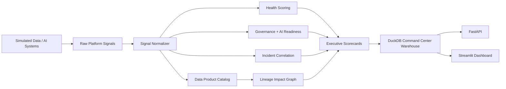
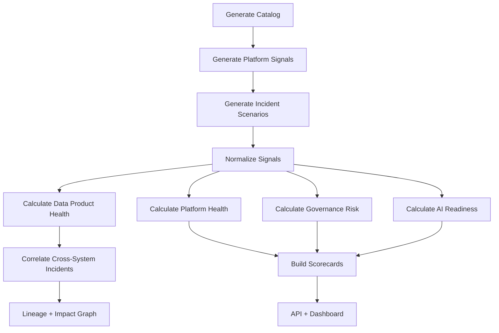

# Enterprise Data Platform Command Center

<!-- REPOSITORY_POLISH_START -->
## Why I Built This

I built this to model an executive/operator command center that turns platform telemetry into scorecards, health views, and reviewable operating signals.

The key challenge I wanted to capture was the part that usually gets hidden in simple demos: how data, signals, decisions, constraints, evidence, and operating risk move through a system that someone else could inspect and run locally.

I intentionally kept this version local and synthetic because the goal is to make the architecture and tradeoffs reviewable without external services, private data, paid APIs, or cloud setup.

## Real Business Problem

Enterprise data platforms need a unified view of reliability, governance, data quality, AI readiness, semantic trust, and operating risk.

This matters because production teams do not only need outputs. They need evidence, ownership, repeatable validation, failure modes, and a path from local prototype to governed production system.

## What This Project Proves

- platform observability
- scorecard design
- data governance
- executive reporting
- API/dashboard serving
- systems integration thinking
- production-style data pipeline design
- synthetic but realistic data modeling
- scorecard generation
- testable architecture
- honest limitation framing

## Architecture In Plain English

Synthetic platform signals are generated, scored, aggregated into command-center outputs, and served through API/dashboard layers with documentation and CI validation.

The important pattern is that inputs are not just transformed into outputs. They are turned into scored, documented artifacts that can be reviewed by operators, analysts, engineers, and business stakeholders.

## Key Design Decisions

- Synthetic data keeps the repo safe to run and share publicly.
- Deterministic local logic makes validation repeatable without paid APIs.
- DuckDB or local artifacts provide warehouse-style inspection without cloud setup.
- FastAPI shows how the system could be served as a service layer.
- Streamlit gives reviewers a fast way to inspect the outputs visually.
- Scorecards make quality, risk, reliability, or readiness measurable.
- Tests and Ruff keep the repo from being only documentation.
- Docker/CI files show the intended deployment shape without claiming production readiness.

See [docs/design-decisions.md](docs/design-decisions.md) for the detailed tradeoff record.

## Validation Evidence

Latest validation run: 2026-06-02.

- Pipeline: passed
- Pytest: passed (61 tests)
- Ruff: passed
- Repository quality docs check: passed
- Detailed command output is recorded in [docs/validation-log.md](docs/validation-log.md).

## Generated Artifacts To Inspect

- platform health scorecards
- governance metrics
- reliability outputs
- AI-readiness views
- FastAPI endpoints
- Streamlit dashboard

## How To Review This Repo

Recruiter / hiring manager:
- Read this README first.
- Review [docs/recruiter-summary.md](docs/recruiter-summary.md) if present.
- Check [docs/validation-log.md](docs/validation-log.md).
- Use [docs/repo-review-guide.md](docs/repo-review-guide.md) for the quickest path.

Senior engineer:
- Review the architecture docs.
- Inspect the `src/` modules.
- Inspect tests and generated scorecards.
- Read [docs/design-decisions.md](docs/design-decisions.md) and [docs/tradeoffs-and-simplifications.md](docs/tradeoffs-and-simplifications.md).

Interview path:
- Run the pipeline command from the validation log.
- Launch the dashboard or API if this repo includes them.
- Explain one design decision and one simplification honestly.

## Known Limitations

- Synthetic data only.
- Local prototype rather than deployed production system.
- Deterministic rules or simulations where a production system may use live models, streaming data, or enterprise integrations.
- No real sensitive data is used.
- No authentication, RBAC, secrets management, or production security boundary unless explicitly stated elsewhere in the repo.
- External systems are simulated instead of connected live.

## Production Roadmap

- connect real platform telemetry
- integrate catalog/lineage tools
- deploy warehouse/lakehouse storage
- add alert routing
- add auth and ownership workflows

See [docs/production-roadmap.md](docs/production-roadmap.md) for the staged roadmap.
<!-- REPOSITORY_POLISH_END -->


## Executive Summary

This project simulates an enterprise data and AI platform control plane.

A basic portfolio project asks: "Can this pipeline, model, or dashboard work?"

This project asks: "Can leadership see whether the entire data platform is healthy, governed, reliable, and ready for AI?"

Large enterprises often have separate tools for data quality, pipeline incidents, semantic metrics, AI governance, RAG evaluation, model monitoring, and lineage. The challenge is not lack of signals. The challenge is fragmented signals.

This project demonstrates platform-level data engineering: turning fragmented quality, governance, reliability, and AI signals into a unified enterprise command center.

## Business Problem

Enterprise data platforms are fragmented. Data quality teams track failed checks, data engineering teams track DAG failures, MLOps teams track model drift, AI teams track RAG hallucination risk, governance teams track policy violations, and analytics teams track metric trust issues. Executives need one answer: is the data platform healthy enough for AI?

## Project Goal

Build a production-style local command center that simulates platform signals from multiple enterprise data and AI systems, normalizes them into a common platform model, calculates unified platform health scores, correlates incidents, generates governance and AI readiness heatmaps, tracks data product health, summarizes SLA compliance, and exposes executive summaries through API and dashboard layers.

## Core Business Question

Is the enterprise data platform healthy, governed, reliable, and ready for AI consumption?

## Architecture



## Control-Plane Flow



## Simulated Systems

- AI-ready Data Quality Command Center
- Enterprise RAG Evaluation Lab
- Payments Fraud Feature Store + MLOps
- Production Pipeline Reliability Lab
- Semantic Metrics Trust Layer
- AI Data Governance Gateway

## Evidence Generated by the Pipeline

- `platform_health_scorecard.json/csv`: enterprise-level platform health and drivers.
- `enterprise_risk_summary.json/csv`: highest cross-system platform risks.
- `data_product_health_report.json/csv`: health score per data product.
- `governance_heatmap.json/csv`: governance risk by domain and product.
- `ai_readiness_summary.json/csv`: AI readiness by product and system.
- `platform_sla_report.json/csv`: SLA compliance summary.
- `cross_platform_incident_report.json/csv`: correlated incidents and downstream impact.
- `system_dependency_graph.json`: dependency graph across systems, products, consumers, and incidents.

## How To Run

```bash
python -m venv .venv
source .venv/bin/activate
python -m pip install --upgrade pip
python -m pip install -r requirements.txt

python -m src.data_generation.generate_data_product_catalog
python -m src.data_generation.generate_platform_signals
python -m src.data_generation.generate_incident_scenarios
python -m src.pipeline.run_all
python -m pytest
python -m ruff check .

streamlit run src/dashboard/app.py
uvicorn src.api.main:app --reload
```

## API

Endpoints include `/health`, `/platform-summary`, `/data-products`, `/incidents`, `/governance-heatmap`, `/ai-readiness`, `/sla-report`, `/lineage-impact`, `/executive-summary`, `/scorecards`, `/simulate-incident`, and `/refresh-platform-health`.

## Known Limitations

- Synthetic signals only
- Local DuckDB instead of an enterprise warehouse
- Deterministic scoring rules
- Simulated integrations instead of real tool APIs
- No cloud deployment
- No authentication
- No real alerting integration
- No OpenLineage, Datadog, Monte Carlo, Collibra, or Atlan integration yet

## Future Enhancements

- Real ingestion from previous portfolio project outputs
- OpenLineage/Marquez integration
- DataHub/OpenMetadata integration
- Datadog/Prometheus/Grafana integration
- Monte Carlo/Bigeye-style observability
- PagerDuty/Slack alert routing
- Snowflake/Databricks deployment
- dbt metadata ingestion
- MLflow model registry ingestion
- Role-based access control

## STAR Story

### Situation
Enterprise data and AI platforms generate many health signals across quality, pipelines, RAG systems, ML models, semantic metrics, and AI governance. Those signals are fragmented, making platform risk hard to see.

### Task
Build a unified command center that normalizes signals, calculates health scores, correlates incidents, and provides executive visibility into reliability, governance, AI readiness, and downstream impact.

### Action
Created synthetic platform signals, common data product health models, scoring engines, incident correlation, SLA summaries, governance heatmaps, lineage impact graphs, API endpoints, dashboards, tests, Docker, and CI/CD.

### Result
Produced a reproducible portfolio project that demonstrates platform-level data engineering and AI infrastructure thinking.

## Project Status

V0.1: Working baseline.

<!-- FUTURE_ENHANCEMENT_SCORECARD_START -->
## Future Enhancement Readiness

I added a small readiness scorecard so the production roadmap is not just prose. The check reads `config/future_enhancements.json`, verifies the repo has the expected roadmap/review artifacts, and writes:

- `data/scorecards/future_enhancement_readiness.json`
- `data/scorecards/future_enhancement_readiness.csv`

Run it with:

```bash
python scripts/generate_future_enhancement_scorecard.py
```

This is a local planning signal, not a claim that the repository is production-ready.
<!-- FUTURE_ENHANCEMENT_SCORECARD_END -->

