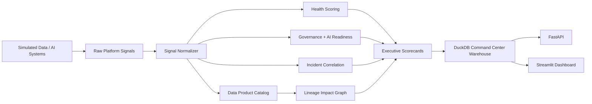
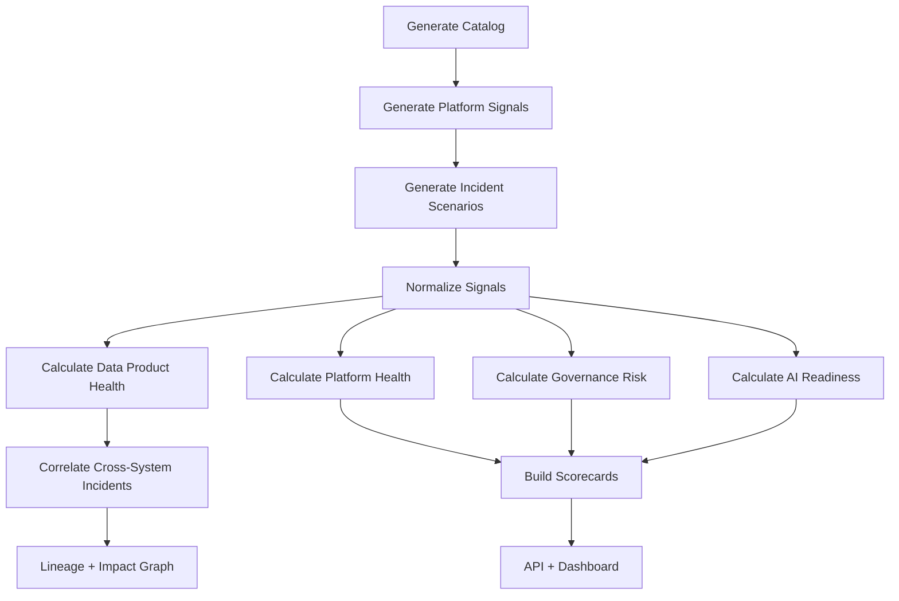

# Enterprise Data Platform Command Center


## Executive Summary

This project simulates an enterprise data and AI platform control plane.

A basic portfolio project asks: "Can this pipeline, model, or dashboard work?"

This project asks: "Can leadership see whether the entire data platform is healthy, governed, reliable, and ready for AI?"

Large enterprises often have separate tools for data quality, pipeline incidents, semantic metrics, AI governance, RAG evaluation, model monitoring, and lineage. The challenge is not lack of signals. The challenge is fragmented signals.

This project demonstrates platform-level data engineering: turning fragmented quality, governance, reliability, and AI signals into a unified enterprise command center.

## Business Problem

Enterprise data platforms are fragmented. Data quality teams track failed checks, data engineering teams track DAG failures, MLOps teams track model drift, AI teams track RAG hallucination risk, governance teams track policy violations, and analytics teams track metric trust issues. Executives need one answer: is the data platform healthy enough for AI?

## Project Goal

Build a production-style local command center that simulates platform signals from multiple enterprise data and AI systems, normalizes them into a common platform model, calculates unified platform health scores, correlates incidents, generates governance and AI readiness heatmaps, tracks data product health, summarizes SLA compliance, and exposes executive summaries through API and dashboard layers.

## Core Business Question

Is the enterprise data platform healthy, governed, reliable, and ready for AI consumption?

## Architecture



## Control-Plane Flow



## Simulated Systems

- AI-ready Data Quality Command Center
- Enterprise RAG Evaluation Lab
- Payments Fraud Feature Store + MLOps
- Production Pipeline Reliability Lab
- Semantic Metrics Trust Layer
- AI Data Governance Gateway

## Evidence Generated by the Pipeline

- `platform_health_scorecard.json/csv`: enterprise-level platform health and drivers.
- `enterprise_risk_summary.json/csv`: highest cross-system platform risks.
- `data_product_health_report.json/csv`: health score per data product.
- `governance_heatmap.json/csv`: governance risk by domain and product.
- `ai_readiness_summary.json/csv`: AI readiness by product and system.
- `platform_sla_report.json/csv`: SLA compliance summary.
- `cross_platform_incident_report.json/csv`: correlated incidents and downstream impact.
- `system_dependency_graph.json`: dependency graph across systems, products, consumers, and incidents.

## How To Run

```bash
python -m venv .venv
source .venv/bin/activate
python -m pip install --upgrade pip
python -m pip install -r requirements.txt

python -m src.data_generation.generate_data_product_catalog
python -m src.data_generation.generate_platform_signals
python -m src.data_generation.generate_incident_scenarios
python -m src.pipeline.run_all
python -m pytest
python -m ruff check .

streamlit run src/dashboard/app.py
uvicorn src.api.main:app --reload
```

## API

Endpoints include `/health`, `/platform-summary`, `/data-products`, `/incidents`, `/governance-heatmap`, `/ai-readiness`, `/sla-report`, `/lineage-impact`, `/executive-summary`, `/scorecards`, `/simulate-incident`, and `/refresh-platform-health`.

## Known Limitations

- Synthetic signals only
- Local DuckDB instead of an enterprise warehouse
- Deterministic scoring rules
- Simulated integrations instead of real tool APIs
- No cloud deployment
- No authentication
- No real alerting integration
- No OpenLineage, Datadog, Monte Carlo, Collibra, or Atlan integration yet

## Future Enhancements

- Real ingestion from previous portfolio project outputs
- OpenLineage/Marquez integration
- DataHub/OpenMetadata integration
- Datadog/Prometheus/Grafana integration
- Monte Carlo/Bigeye-style observability
- PagerDuty/Slack alert routing
- Snowflake/Databricks deployment
- dbt metadata ingestion
- MLflow model registry ingestion
- Role-based access control

## STAR Story

### Situation
Enterprise data and AI platforms generate many health signals across quality, pipelines, RAG systems, ML models, semantic metrics, and AI governance. Those signals are fragmented, making platform risk hard to see.

### Task
Build a unified command center that normalizes signals, calculates health scores, correlates incidents, and provides executive visibility into reliability, governance, AI readiness, and downstream impact.

### Action
Created synthetic platform signals, common data product health models, scoring engines, incident correlation, SLA summaries, governance heatmaps, lineage impact graphs, API endpoints, dashboards, tests, Docker, and CI/CD.

### Result
Produced a reproducible portfolio project that demonstrates platform-level data engineering and AI infrastructure thinking.

## Project Status

V0.1: Working baseline.
